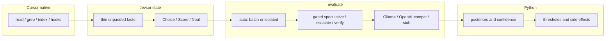
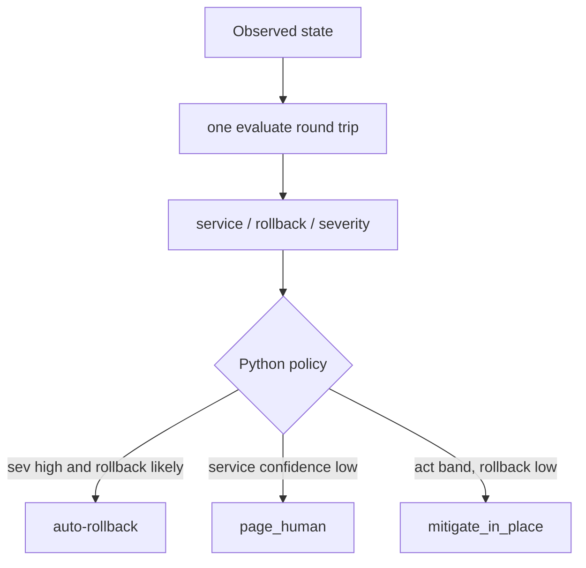
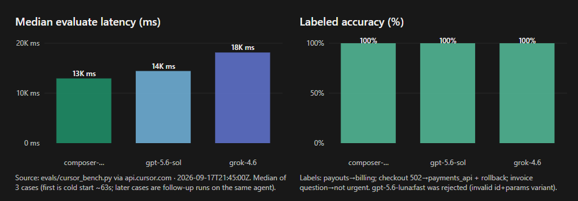

<div align="center">

# Jevsor ⚡

**A typed, Jev-compatible decision engine over your models with dynamic action spaces.**

<p align="center">
  <a href="LICENSE"></a>
  <a href="pyproject.toml"></a>
  <a href="plugin/skills/jevsor/SKILL.md"></a>
  <a href="evals/results/cursor_live.json"></a>
</p>

<p align="center">
  <a href="docs/ARCHITECTURE.md">Architecture</a> •
  <a href="#the-decision-space">Decision Space</a> •
  <a href="#try-it">Quickstart</a> •
  <a href="#use-the-library">Usage</a> •
  <a href="#evidence-and-limits">Benchmark</a> •
  <a href="evals/results/cursor_live.json">Measurements</a> •
  <a href="src/jevsor/runner.py">Read the loop</a> •
  <a href="docs/HONESTY.md">Honesty Contract</a>
</p>

<p align="center">
Give it unstructured state. Your model evaluates typed <code>Choice</code>, <code>Score</code>, and <code>Noul</code> questions without ever seeing the question keys.<br>
Code owns the control flow, thresholds, and execution.
</p>

<p align="center">
<b>Incident triage to automated PR-hold in 6.4 ms offline, 9/9 on live Cursor models.</b><br>
One structured evaluation cycle, atomic questions, and code-owned routing.
</p>

</div>

<br>

## Architecture



Question keys stay out of the prompt. The model returns likelihoods. Python owns rollback, paging, and hold. Cursor owns retrieval, tools, and the agent loop. See [docs/ARCHITECTURE.md](docs/ARCHITECTURE.md).

## The decision space

Every state observation produces a typed decision map:

```python
state = {
    "channel": "#inc-checkout",
    "symptom": "checkout POST /v1/pay returns 502 for ~18% of requests",
    "started_after": "payments-api deploy 14:02 UTC (sha 7f3c1a)",
    "error": "upstream connect error to billing-ledger:8443",
    "slo": "checkout availability 99.9%; currently 82% over 15m",
    "recent_changes": ["payments-api: timeout 2s -> 800ms on ledger client"],
}
```

The question heads are `Choice` (discrete categorical distribution), `Score` (expected ordinal metric `[0, K-1]`), and `Noul` (binary P(yes) Bernoulli likelihood).



Target questions are speculative. If severity is major and rollback probability exceeds the threshold, rollback executes immediately. Two decisions, **one network round trip**. Each question head contains only compatible criteria.

There are no free-form agent chat loops or prompt-injected action scripts in the policy. The incident example supplies state and independently verifies the outcome in code. Model output never becomes unvetted shell commands, raw SQL, or unsupervised actions.

## Try it

```bash
git clone https://github.com/kleosr/jevsor.git jevsor
cd jevsor
uv sync --extra dev --extra mcp
# Run offline immediately on the deterministic stub:
uv run python examples/triage.py
```

Run the live MCP inspector against the stdio server:

```bash
bash tests/inspector_smoke.sh
```

Or execute the real-world incident test:

```bash
uv run python evals/realworld_incident.py
```

Connect your own provider:
- **Offline Stub:** zero credentials required, 100% deterministic test fixtures.
- **Local Ollama:** `OLLAMA_BASE_URL=http://127.0.0.1:11434/v1` (measured single-token logprobs).
- **OpenAI-compatible / vLLM:** `OPENAI_API_KEY=...` and `OPENAI_BASE_URL=...`.
- **Cursor Cloud API:** `CURSOR_API_KEY=crsr_...` (runs `composer-2.5:fast`, `grok-4.6`, or `gpt-5.6-sol`).

## Use the library

```python
from jevsor import Client, Choice, Noul, Score, route_band

state = {
    "ticket": "Help! My payouts have been failing for 3 days.",
    "account_age_days": 800,
}

with Client(provider="stub", fanout="auto") as client:  # or "ollama"; MCP inside Cursor
    result = client.evaluate(
        state=state,
        questions={
            "dept": Choice("Which team should handle this?", {
                "billing": "Payments, invoicing, refunds",
                "technical": "Bugs, outages, integrations",
                "sales": "Pricing, upgrades, new accounts",
            }),
            "urgent": Noul("Does this convey urgency?"),
            "frustration": Score("How frustrated is the customer?", [
                "Calm", "Frustrated", "Very angry",
            ]),
        },
    )

dept = result.answers["dept"]
urgent = result.answers["urgent"]

# Combine in code — thresholds belong in Python, not in prompts:
if route_band(dept.confidence) == "human" or dept.confidence < 0.6:
    print("Escalate to human on-call:", dept.choice, f"conf={dept.confidence}")
elif urgent.noul >= 0.8:
    print("High-priority dispatch:", dept.choice)
else:
    print("Standard queue dispatch:", dept.choice)
```

Run with `uv run python your_script.py`. The same policy can run inside Cursor via the MCP plugin:

```json
{
  "state": {"ticket": "Help! My payouts have been failing for 3 days."},
  "questions": {
    "dept": {
      "type": "choice",
      "instructions": "Which team?",
      "criteria": {"billing": "payments", "tech": "bugs"}
    },
    "urgent": {"type": "noul", "instructions": "Urgent?"}
  }
}
```

Cursor stdio MCP server command (installed via uvx):

```bash
uvx --from . --with mcp jevsor-mcp
```

## Why it moves

- **One request per decision cycle.** Batch multiple atomic questions over thin state in a single call.
- **No chat tokens wasted on reasoning narration.** The model emits letter likelihoods or a strict probability object, not conversational filler.
- **Keys stay out of the prompt.** Question keys are ids only (`dept`, `rollback`). The model never sees the keys, eliminating label bias and prompt-injection leaks.
- **Code owns control flow.** Thresholds (`route_band`, cutoffs) and side effects remain strictly in Python, not in model hallucinations.
- **Strict provenance tracking.** Distinguishes `measured` (token logprobs) from `prompted` (JSON distributions) — never mixes or averages them without flagging `mixed_provenance`.
- **Zero proprietary lock-in.** Works offline on stubs, locally on Ollama, or through OpenAI/vLLM. Inside Cursor, use the MCP plugin — do not nest a Cloud Agent per decision.

## Small enough to read

| File | Job |
| --- | --- |
| [runner.py](src/jevsor/runner.py) | Client loop: auto/batch/isolated, speculative heads, escalate, verify |
| [schedule.py](src/jevsor/schedule.py) | Deterministic fan-out: prompted batch vs measured isolated |
| [policy.py](src/jevsor/policy.py) | Bands, gates, disagreement, MCP `route` |
| [contract.py](src/jevsor/contract.py) | Choice, Score, Noul schemas and response models |
| [letter.py](src/jevsor/letter.py) | Single-token letter/digit logprob extraction and softmax normalization |
| [codecs.py](src/jevsor/codecs.py) | Measured vs prompted decoder with distribution validation |
| [confidence.py](src/jevsor/confidence.py) | Normalized inverse-entropy confidence calculation and three-band router |
| [mcp_server.py](src/jevsor/mcp_server.py) | FastMCP stdio: `evaluate` + `route` |
| [cursor_agent.py](src/jevsor/providers/cursor_agent.py) | Optional Cloud Agents backend (second harness; not in-IDE native) |
| [ARCHITECTURE.md](docs/ARCHITECTURE.md) | Native Cursor split, keep/modify table, literature |
| [cursor_bench.py](evals/cursor_bench.py) | Live Cursor model speed and accuracy benchmark |
| [calibration.py](evals/calibration.py) | Expected Calibration Error (ECE) and temperature-scaling report |

## Evidence and limits

The offline incident test executes in **6.47 ms** on the deterministic stub client and **3.03 ms** through the MCP stdio pipeline, with bitwise agreement across Client, MCP payload, and CLI Inspector.

<p align="center">
  
</p>

In our live Cursor Cloud Agents API benchmark across 9 labeled engineering questions (`evals/results/cursor_live.json`):
- `composer-2.5:fast`: **9/9 (100%) accuracy**, **12.96s** median follow-up latency (**88s** total including cloud container warm-up).
- `gpt-5.6-sol`: **9/9 (100%) accuracy**, **14.44s** median follow-up latency, highest confidence peaks (0.83–0.90).
- `grok-4.6`: **9/9 (100%) accuracy**, **18.15s** median follow-up latency.
- `gpt-5.6-luna:fast`: rejected due to invalid param variant.

Calibration baseline: ECE is **0.182** on measured logprobs vs **0.750** on prompted verbalized probabilities (`evals/quality_pin.json`).

**Honest Limits:**
- Jevsor reproduces Jev's *application contract*, not TypeSafe's proprietary sampler or weights.
- Isolated fan-out is N round trips; batch prompted shares prompt context.
- Probabilities are uncalibrated until fitted against ground truth with `evals/calibration.py`.
- Cursor Cloud Agent calls take 9–18s per turn because they execute through an agent sandbox rather than a direct raw-token sampler. That backend is optional and marked `second_harness`.

## Development

```bash
uv run pytest
uv run python evals/benchmark.py --check evals/quality_pin.json
bash tests/inspector_smoke.sh
uv build
```

Tests are offline and deterministic. Quality pins enforce ECE and probability mass conservation across changes.

---

<div align="center">

[TypeSafe Jev application contract](https://docs.typesafe.ai/introduction) • [Cursor Agent Plugins](https://agent-plugins.org) • [Model Context Protocol](https://modelcontextprotocol.io)

</div>
