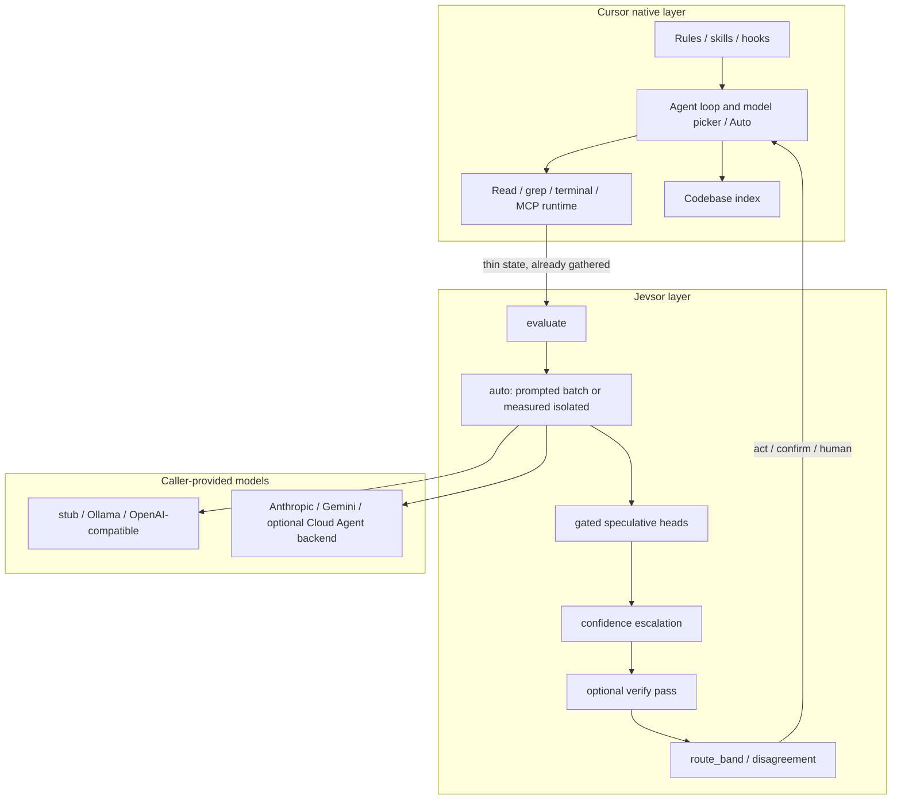

# Architecture

Jevsor is a **decision and parallel-evaluation layer**. It is not a second agent harness.

Cursor already runs the agent loop, retrieves context, indexes the repo, executes tools, enforces rules and hooks, and (on Auto) routes whole agent turns across models. Jevsor adds what that loop does not: typed questions over thin state, independent heads, deterministic combination, and confidence-aware routing.

The hosted TypeSafe model named Jev cannot be reproduced. Its parallel sampler, RLCD calibration, type-safe decoding, and 70–500ms economics are implementation details of that model. Jevsor copies the **application contract** and schedules it onto ordinary LLMs, including the models Cursor already exposes to the agent.

## Native split

### Cursor native (do not rebuild)

| Surface | What Cursor already does | Jevsor's job |
| --- | --- | --- |
| Agent execution | Tool loop, modes, subagents, CLI `agent` | None. Gather state, then call `evaluate`. |
| Model invocation | User picker and [Cursor Router / Auto](https://cursor.com/docs/cursor-router) on **agent turns** | Do not reimplement Auto. Probe logprobs vs prompted JSON. |
| Context / indexing | `@codebase`, grep, semantic index | Consume facts the agent already read. Do not re-index. |
| Tools | Read, edit, shell, MCP, browser | Side effects stay in Cursor tools. |
| Parallelism | Concurrent tool calls, Task subagents | Parallel **questions**, not parallel agents. |
| Rules / hooks | Persistent policy, deny/allow | Do not duplicate enforcement. |
| Skills / plugins | Discovery + MCP install | Ship skill + MCP only (Agent Plugin). |
| Cloud Agents API / SDK | Full agent runs, not raw completions ([docs](https://cursor.com/docs/sdk/python): “not a standalone chat-completions or raw inference API”) | Optional last-resort prompted backend. Sets `debug.second_harness`. |

Unsupported from a plugin: Cursor's private sampler, KV cache, internal router weights, or a raw completion endpoint for in-IDE models. There is no documented way for Jevsor to “call Composer as a logprob head” inside the editor. The native path is: **the Cursor agent is the orchestrator; Jevsor is a tool it calls.**

### Jevsor layer (what we add)

| Piece | Owner |
| --- | --- |
| State (thin JSON/text) | Caller / Cursor agent |
| Questions (Choice / Score / Noul) | Caller |
| Fan-out schedule | Deterministic code (`schedule.py`) |
| Letter logprobs / prompted JSON | Model |
| Normalization, keys-as-ids | Code |
| Speculative head inclusion | Code (batch: include; isolated: gate) |
| Confidence statistic | Code (`1 - H(p)/log(K)`; noul uses `|p-0.5|*2`) |
| Thresholds, rollback, paging | Caller code / MCP `route` |
| Escalation / verify | Opt-in code |
| Human escalation | Caller after `human` band |

## Jev internals vs LLM analogue

From TypeSafe's public docs ([System One](https://docs.typesafe.ai/concepts/system-one.md), [primitives](https://docs.typesafe.ai/primitives.md), [fan-out](https://docs.typesafe.ai/patterns/fan-out.md), [confidence](https://docs.typesafe.ai/confidence.md), [state](https://docs.typesafe.ai/concepts/state.md), [introducing Jev](https://typesafe.ai/blog/introducing-system-one-models-and-jev)):

**Essential to the design**

- Unstructured state in, typed probabilistic decisions out.
- Three heads: Choice, Score, Noul.
- Many independent questions, same state, composed in code.
- Speculative fan-out: ask heads you might need; ignore the rest in code.
- Question ids are for your code, not instructions.
- Confidence is a second axis: act / confirm / human. Thresholds scale with risk.
- A second request only when the next state cannot be built without the first answer.
- High-cardinality Choice (up to 255) may use a two-stage independent score then normalize — Jevsor's wide-choice path.

**Jev implementation details we do not claim**

- Parallel sampler / shared-KV readout (adding a question barely changes latency).
- RLCD calibration.
- Output tokens free; $0.042/MTok.
- 70–500ms end-to-end.
- Sampler-enforced zero type errors.
- TypeSafe's unpublished confidence formula.

TypeSafe's own LLM wrapper is the honest analogue: constrain an LLM to the System One schema. They report it as slower and more expensive than Jev, and the most accurate way to get decisions from LLMs. Jevsor **is** that wrapper, plus scheduling that reflects LLM cost.

On Jev, extra questions are almost free in latency. On an LLM:

- **Prompted batch** ≈ Jev fan-out: one JSON object, extra heads are cheap tokens, same round trip, but questions can attend to each other.
- **Isolated measured** ≠ Jev fan-out: N single-token calls, true isolation, N× state tokens. Speculative heads must be gated.

## Literature (compared, not copied)

| Result | What it supports here | What we reject |
| --- | --- | --- |
| [STEER](https://arxiv.org/abs/2511.06190) confidence-guided stepwise routing | Cheap first pass; spend more only when uncertain (`escalate`) | Training a router on Cursor internals |
| [Cascade routing](https://arxiv.org/html/2410.10347v2), [FrugalGPT](https://arxiv.org/abs/2305.05176), [RouteLLM](https://arxiv.org/abs/2406.18665) | Quality estimators + cheap→expensive | Replacing Cursor Auto for whole agent turns |
| [DenoiseFlow](https://arxiv.org/pdf/2603.00532) adaptive branching | Fan-out only on uncertain slots | Uniform N-way branching on every step |
| [CARE](https://arxiv.org/html/2607.26052v2) confidence-adaptive MoE | Spend experts where the distribution is flat | Token-level MoE inside Cursor weights |
| [Faster cascades via speculative decoding](https://arxiv.org/html/2405.19261v1) | Parallel verify of a draft | Token-level speculative decoding (no sampler access) |
| [HASSUM](https://arxiv.org/pdf/2608.14707.pdf) semantic uncertainty | Disagreement as an escalation signal | Multi-sample semantic entropy by default (cost) |
| [Agent-as-a-Router](https://arxiv.org/html/2606.22902v2) | Execution-grounded routing for coding | A second orchestrator agent |
| TypeSafe [SDE cascade](https://docs.typesafe.ai/cookbooks/sde_cascade.md) | mini → verify → reasoning | Always running the expensive pass |

## Keep / Modify / Replace / Remove / Add

| Component | Decision | Why |
| --- | --- | --- |
| Choice / Score / Noul contract | **Keep** | This *is* the Jev application contract. |
| Keys-as-ids | **Keep** | Public TypeSafe rule; reduces label bias. |
| Measured letter logprobs | **Keep** | Best likelihoods we can get without Jev's sampler. |
| Prompted JSON fallback | **Keep** | Required for Cursor / Anthropic / many hosted models. |
| Provenance + no silent averaging | **Keep** | Measured ≠ prompted. |
| Inverse-entropy confidence | **Keep** | TypeSafe's formula is unpublished; ours is labeled. |
| `route_band` | **Keep** | Matches TypeSafe's three-path cookbook; thresholds stay caller-owned. |
| Stub / Ollama / OpenAI-compat / Gemini / Anthropic | **Keep** | Caller-provided models. |
| Agent Plugin skill + MCP `evaluate` | **Keep** | The supported Cursor integration. |
| Capability probe cache | **Keep** | Probe beats the static matrix. |
| Wide-choice independent P(fit) | **Keep** | Mirrors Jev's high-cardinality 2-stage path. |
| Honesty docs (no shared KV, no RLCD) | **Keep** | Prevents fake Jev latency/cost claims. |
| Fan-out `batch` vs `isolated` | **Modify** | Add `auto`. Measured → isolated; prompted → one JSON. Mixed letter/wide no longer dumps the whole batch into prompted. |
| Speculative heads | **Add** (was example-only) | Batch includes them (Jev-like). Isolated runs them only when `when` gates match. |
| Confidence escalation | **Add** | Isolated re-ask of confirm/human heads only. Cheap-first for Cursor-class prompted models. |
| Verify + disagreement | **Add** | Second independent pass flags `debug.disagreed`; does not silently replace. |
| MCP `route` | **Add** | Stops the agent inventing thresholds. |
| Cursor Cloud Agents as default “native model” | **Replace** (role) | Still available, but documented as a full agent run (`second_harness`). In-IDE path is MCP-from-agent. |
| Subagent-per-boolean / second harness | **Remove** (never ship) | Duplicates Cursor and burns latency. |
| Cursor rules/hooks inside this plugin | **Remove** (still out) | Cursor already enforces them. |
| Token-level speculative decoding, Auto clone, semantic-entropy sampling | **Reject** | No measurable value on supported APIs. |

## Context, tokens, latency

1. Cursor agent reads files / search hits / diffs into **thin state** (no padding).
2. One `evaluate` call with core questions plus speculative heads.
3. **Prompted models:** one JSON round trip. Extra heads cost output tokens, not extra latency.
4. **Measured models:** concurrent single-token calls, semaphore 8. Speculative heads skipped until a gate on a core answer is true.
5. **Escalate (opt-in):** only uncertain heads get an isolated second pass.
6. **Verify (opt-in):** independent pass; disagreement → treat as `human` in caller code.
7. Cursor tools execute the side effects. Hooks still gate shell/MCP.

Error handling stays fail-closed: transport retries, bounded JSON repair, isolated all-or-nothing, MCP returns `{error, status}` rather than crashing stdio.

## Using models Cursor already exposes

- **In the editor / CLI agent:** pick the model in Cursor (or Auto). The agent gathers state with native tools and calls MCP `evaluate`. Jevsor should use `stub` (tests), local Ollama, or any OpenAI-compatible endpoint you configure — not a nested Cloud Agent.
- **Headless Cloud Agent as a prompted backend:** `Client(provider="cursor", ...)` only when you explicitly want a remote agent to emit JSON. Expect multi-second sandbox latency. `debug.second_harness` is true.
- **Do not** send Auto/`auto-smart` through Jevsor to “route questions.” Cursor Router classifies **agent requests**, not Choice heads.

## What “done” means

The Cursor agent remains the harness. Jevsor remains a typed `evaluate`/`route` service with tests for schedule, gates, escalation, and disagreement. No second tool loop, no re-indexer, no fake shared-KV.
